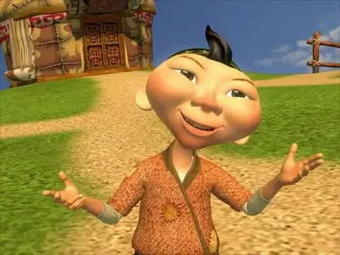

# Aldar Köse Storyboard Generator

Transform any story idea into a high-quality visual storyboard featuring the beloved Kazakh folk hero **Aldar Köse**!

This project uses **GPT-4** for intelligent story understanding and **Stable Diffusion XL** for locally-generated, culturally authentic illustrations — optimized for M1 MacBook Air.



## Features

✨ **Intelligent Story Creation**
- Enter ANY prompt in Kazakh, Russian, or English
- GPT-4 automatically transforms it into an Aldar Köse tale
- Generates 5-9 frame storyboards with coherent narrative flow

🎨 **High-Quality Local Image Generation**
- Stable Diffusion XL running locally on your M1 Mac
- Character consistency based on your 5 reference images
- 2D storybook illustration style with Kazakh cultural authenticity
- Parallel generation for speed (~30-60 seconds for full storyboard)

🇰🇿 **Cultural Authenticity**
- Traditional Kazakh elements (yurts, dombra, chapan, steppe)
- Warm color palette matching folk art aesthetic
- Proper representation of Kazakh culture and settings

⚡ **Optimized for M1**
- Uses Metal Performance Shaders (MPS) for GPU acceleration
- FP16 precision for 2x speed boost
- Memory-efficient parallel generation
- Quality validation with auto-regeneration

## System Requirements

- **macOS** with Apple Silicon (M1/M2/M3)
- **RAM**: 8GB minimum (16GB recommended)
- **Storage**: 15GB free space (for models and cache)
- **Python**: 3.9 or higher
- **Internet**: For initial model download (~7GB)

## Quick Start

### 1. Clone the Repository

```bash
git clone https://github.com/yourusername/qylysh-higgsfiled.git
cd qylysh-higgsfiled
```

### 2. Add Your OpenAI API Key

Create a `.env` file:

```bash
OPENAI_API_KEY=your_api_key_here
```

Get your key from: https://platform.openai.com/api-keys

### 3. Run Automated Setup

```bash
python3 setup.py
```

This will:
- Install all dependencies (~3GB download)
- Download Stable Diffusion XL model (~7GB)
- Configure character consistency from reference images
- Set up directories and environment

### 4. Start the Server

```bash
python3 app.py
```

### 5. Open Your Browser

Visit: **http://localhost:8080**

Enter a story prompt and watch the magic happen!

## How It Works

### Architecture

```
User Input (any language)
    ↓
GPT-4 Story Understanding & Creation
    ↓
GPT-4 Generates 5-9 Detailed Frames
    ↓
Enhanced Prompt Builder (adds character details)
    ↓
Local SDXL + Character Consistency (Parallel)
    ↓
Quality Validation & Auto-Regeneration
    ↓
High-Quality Storyboard Output
```

### Key Components

1. **`config.py`** - System configuration (device, model, quality settings)
2. **`prompt_enhancer.py`** - Transforms frame descriptions into optimized SDXL prompts
3. **`local_image_generator.py`** - Parallel SDXL generation with M1 optimization
4. **`quality_validator.py`** - Validates image quality and triggers regeneration
5. **`storyboard_generator.py`** - Main orchestration logic
6. **`app.py`** - Flask web server
7. **`train_aldar_lora.py`** - Character configuration setup

### Character Consistency

The system maintains Aldar Köse's consistent appearance using:

- **Reference-based prompting**: Detailed descriptions extracted from your 5 reference images
- **Enhanced prompts**: Automatic injection of character details in every generation
- **Negative prompts**: Prevent common errors (wrong ethnicity, modern clothing, etc.)
- **Quality validation**: Auto-detect and regenerate poor-quality images

## Usage Examples

### Example 1: Simple Prompt

**Input:**
```
A greedy merchant learns about sharing
```

**Output:**
- 7 frames showing Aldar Köse teaching a merchant to be generous
- Kazakh village setting, traditional elements
- Clear moral lesson with humor

### Example 2: Kazakh Language

**Input:**
```
Алдар Көсе бай адамның ақшаны бөлісуді үйретеді
```

**Output:**
- All text in Kazakh
- Culturally appropriate storytelling
- Same high-quality illustrations

### Example 3: Complex Story

**Input:**
```
Aldar Köse uses his wit to solve a village dispute over water rights,
bringing both sides together through clever negotiation
```

**Output:**
- 8-9 frames with establishing shots, dialogue, resolution
- Multiple characters, varied settings
- Coherent narrative arc

## Configuration

Edit `config.py` to customize:

### Image Quality

```python
NUM_INFERENCE_STEPS = 35  # Higher = better quality (20-50)
GUIDANCE_SCALE = 7.5      # How closely to follow prompt (7-9)
IMAGE_WIDTH = 1024        # Output resolution
IMAGE_HEIGHT = 1024
```

### Performance

```python
PARALLEL_BATCH_SIZE = 2   # Images generated at once (1-3 for M1 Air)
ENABLE_ATTENTION_SLICING = True  # Reduce memory usage
ENABLE_VAE_SLICING = True        # Faster decoding
```

### Quality Validation

```python
ENABLE_QUALITY_VALIDATION = True  # Auto-check image quality
MAX_REGENERATION_ATTEMPTS = 2     # Retry failed images
```

## Troubleshooting

### Models Not Downloading

```bash
# Manually download SDXL
python3 -c "from diffusers import StableDiffusionXLPipeline; StableDiffusionXLPipeline.from_pretrained('stabilityai/stable-diffusion-xl-base-1.0')"
```

### Out of Memory Errors

Reduce batch size in `config.py`:

```python
PARALLEL_BATCH_SIZE = 1  # Generate one image at a time
```

### Poor Character Consistency

1. Ensure all 5 reference images are present
2. Run character setup again:
   ```bash
   python3 train_aldar_lora.py
   ```
3. Check `models/aldar_character_config.json` was created

### Slow Generation

First generation downloads models (~7GB), subsequent generations are much faster.

For even better speed:
```python
NUM_INFERENCE_STEPS = 25  # Reduce from 35
```

## API Costs

- **Image Generation**: $0 (runs locally)
- **Story Creation**: ~$0.01-0.02 per request (GPT-4)
- **Total Cost**: ~$0.02 per storyboard

Compare to DALL-E: ~$0.28 per storyboard (7 frames × $0.04)

## File Structure

```
qylysh-higgsfiled/
├── aldar1-5.png              # Reference images for character
├── models/                   # Downloaded AI models (~7GB)
│   ├── aldar_character_config.json
│   └── (SDXL models cached here)
├── static/
│   ├── generated/            # Generated storyboard images
│   ├── css/                  # Stylesheets
│   └── js/                   # Frontend JavaScript
├── templates/
│   └── index.html            # Web interface
├── config.py                 # System configuration
├── prompt_enhancer.py        # Prompt optimization
├── local_image_generator.py  # SDXL generation
├── quality_validator.py      # Quality checks
├── storyboard_generator.py   # Main logic
├── app.py                    # Flask server
├── setup.py                  # Automated setup
└── requirements.txt          # Python dependencies
```

## Development

### Running Tests

```bash
# Test prompt enhancer
python3 prompt_enhancer.py

# Test image generator
python3 local_image_generator.py

# Test quality validator
python3 quality_validator.py

# Test storyboard API
python3 test_api.py
```

### Adding Custom Prompts

Edit `prompt_enhancer.py` to modify how prompts are built:

```python
def enhance(self, frame: Dict[str, Any]) -> str:
    # Add your custom prompt modifications here
    ...
```

## Advanced Features

### LoRA Training (Optional)

For even better character consistency, train a full LoRA model on Google Colab:

1. Upload reference images to Colab
2. Use Kohya_ss or similar training scripts
3. Download trained LoRA (~50MB)
4. Place in `models/aldar_kose_lora.safetensors`
5. System will automatically use it!

### Batch Generation

Generate multiple storyboards programmatically:

```python
from storyboard_generator import StoryboardGenerator

generator = StoryboardGenerator()

prompts = [
    "Aldar helps a poor family",
    "Aldar outsmarts a greedy khan",
    "Aldar teaches children to be kind"
]

for prompt in prompts:
    result = generator.generate(prompt)
    print(f"Generated: {result['metadata']['num_frames']} frames")
```

## Credits

- **Aldar Köse**: Traditional Kazakh folk hero
- **Stable Diffusion XL**: Stability AI
- **GPT-4**: OpenAI
- **Diffusers**: Hugging Face

## License

MIT License - See LICENSE file for details

## Support

For issues or questions:
1. Check the Troubleshooting section above
2. Review logs in terminal output
3. Open an issue on GitHub

---

Made with ❤️ for preserving and sharing Kazakh culture through AI-powered storytelling
